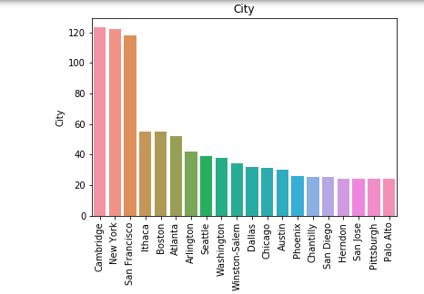
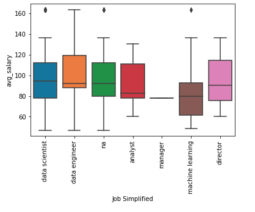
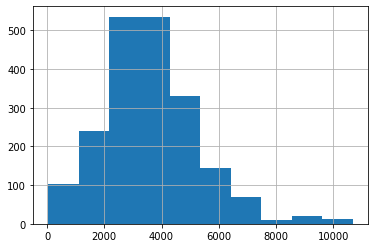
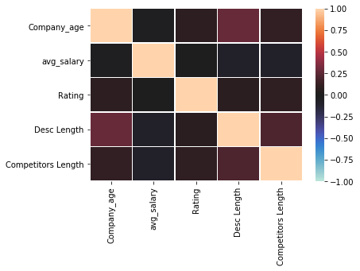
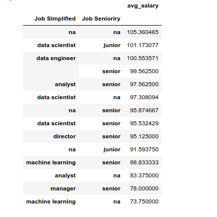
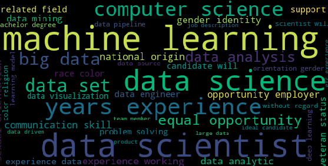

# Data Science salary estimator: Project overview

* Created a tool to estimate fifferent data science jobs Salaries (MAE ~ $17.5K) to help them negotiate their income when       they get a job.

* Scraped over 2000 job descriptions from GlassDoor using python and selenium.

* Cleaned the data and replaced the empty values (-1 in my dataset).

* Engennered Features like python,R,aws,spark... to see if these tools have an impact on the salary or not.
  Devided the location feature to city,state and country to see how the salaries vary based on locations.
  Created a seniority feature to see if it's an entry level position or a senior level position.
 
* Explored the data to find correlations between my independant variables and the dependant variable and to better             anderstand the dataset.

* Tried different Models to obtain the best results:
  linear regression,linear regression with regularization(lasso and ridge),random forest regressor(using Grid search to get     the best hyper parameters for my model),XGBoost regressor and SVM regressor.
  finally i combined my best two models (SVM Regressor and Random Forest Regresssor) to obtain the best result (MAE ~         $17.5K).
  
 * Build a client facing API using flask and deploying it on heroku.
 
 

## Code and Resorces used

#### Code :

 * **Python version**:3.7

 * **Packages**: Pandas,Numpy,Matplotlib,Seaborn,Sklearn,Selenium,Flask,Json,Pickle.
 
 * **For web framework rekwirments**: pip install -r requirments.txt.
 
#### Resorces : 

 * _Selenium Tutorial for Scraping Glassdoor article_:

   https://towardsdatascience.com/selenium-tutorial-scraping-glassdoor-com-in-10-minutes-3d0915c6d905
 
 * _Ken Jee tutoial for the data science salary project_:
 
   https://www.youtube.com/watch?v=GmW4F6MHqqs
 
 * _Productionize a Machine Learning model with Flask and Heroku Tutorial_: 

   https://towardsdatascience.com/productionize-a-machine-learning-model-with-flask-and-heroku-8201260503d2
   
   
   ## Web Scraping
   
   Followed the "Selenium Tutorial for Scraping Glassdoor article" and "Ken Jee tutoial for the data science salary project" to srape about 2000 job postings from GlassDoor and got these features for each of them:
   
  * Company Name          
  * Job Description      
  * Rating               
  * Job Title             
  * Location             
  * Company Headquarters 
  * Copany Size          
  * Company Fouded Date  
  * Type of Ownership    
  * Industry             
  * Sector               
  * Revenue              
  * Competitors          
  * Salary Estimate      
   
   ## Data Cleaning
   
   After scraping the data i had to clean it so i can use it in my model,
   i made the following changes and created the following variables:
   
  * Parsed numeric data out of salay.
  * Removed rows without salary.
  * Parsed ratings out of company name.
  * Made new columns for company state ,city and coutry.
  * Added a column to check if the job was at the companies head quarters or not.
  * Transformed founded date into age of company.
  * Created Columns job semplified and seniority.
  * Column for the description length.
  * Column for the number of competitors.
  * Parsed company revenue.
  * Created columns from job description to check the defferent skills needed in a job:
    * Python
    * R
    * AWS
    * Spark
    * Hadoop
    * BI
    * Excel
   
   
  ## EDA
  
  I looked at the destrebution of numerical variables using histograms looked for some correlations and checked the value counts of the categorical variables. Below some highlights:
  
                   
         
                
  
  
  
  ## Model Building
  
  First i got rid of the features i wan't going to feed to my model, then transformed my categorical variables to dummy variables and also split the data into train_test sets with a test size of 20%.
  
  I tried six different models and evaluated them using MAE. I chose MAE because it's easy to interpret and outliers aren't particulary bad for this type of model.
  * **Different models i tried:**
    * **Linear Regression**: baseline for the model.
    * **Lasso Regression**: because we had a big number of variables after the get dummies we had to regularize our linear model to avoid overfitting.
    * **Ridge Regression**: another way to regularize our linear model.
    * **Random Forest Regressor**: because of the sparse data it looked like a good model.
    * **XGBoost Regressor**: which is similar to random forest but usually faster and gives better results.
    * **SVM Regressor**: i wanted to try the gaussian kernel(RBF) which gave the best result at the end.
    
  ## Model Performance
  
  The SVM and Random forest gave the best results at the end
  * **SVM**: MAE=17.6
  * **Random Forest**: MAE=17.6
  * **XGBoost**: MAE=18.6
  * **Ridge**: MAE=18.6
  * **Lasso**: MAE=18.7
  * **Linear**: MAE=2551.4 obviosly the data can't be separated linearly.
  * **Combination of SVM and Random Forest**: MAE=17.5 slightly better than both models.

## Productionization
In this part i built a flask API endpoint that was hosted in heroku by following along with "Productionize a Machine Learning model with Flask and Heroku Tutorial" and "Ken Jee tutoial for the data science salary project".
the API endpoint takes in a request with a list of values from a job listing (our features) and returns an estimated salary.
